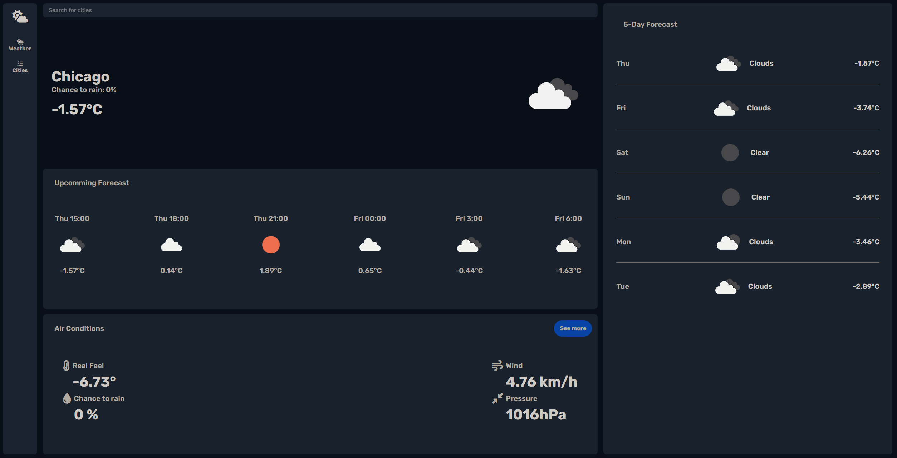
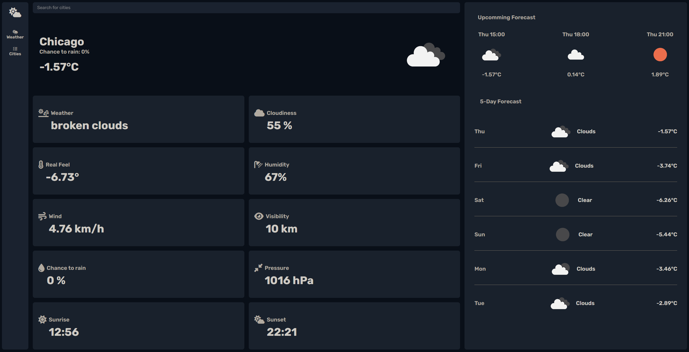
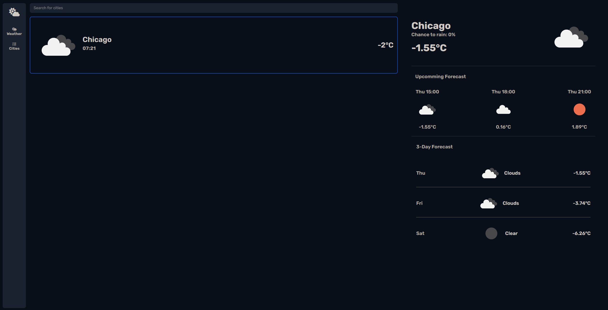
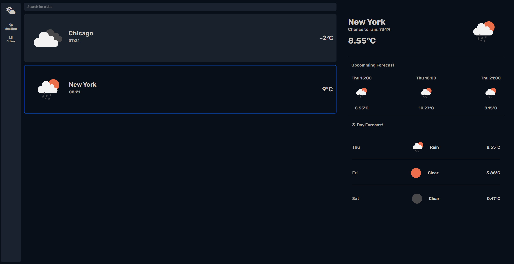

# Weather Application

A weather application developed using **Angular** and **TypeScript** that uses the **OpenWeather API** to retrieve weather forecasts based on the city name entered.

## Features

- Download the current weather for any city.
- Display basic weather information such as:
  - Temperature
  - Humidity
  - Rainfall
  - Wind
- User interface for entering a city and getting real-time results.
- Responsive design - the app works on mobile and desktop devices.

## Development server

Install dependencies `npm install`. Run `npm start` for a dev server. Navigate to `http://localhost:4200/`

## Screenshots

Home Page:

Home Page (See more):

Cities Page:

Cities Page (add another city):

## Used

- TypeScript
- Angular CLI - 19.0.2
- Angular Material
- HTML
- SCSS
- Tailwind
- OpenWeatherApi - https://openweathermap.org/api
